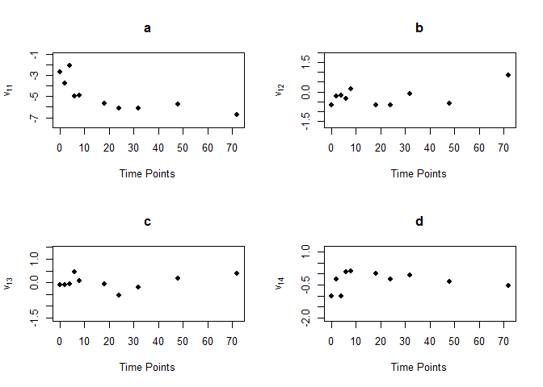

<!-- README.md is generated from README.Rmd. Please edit that file -->

# MLGM

<!-- badges: start -->

Joint mean-covariance modeling of multiple longitudinal data helps with
understanding the trends and dependence patterns among repeatedly
measured outcomes. This R implements functions to profile plots and
multivariate regressograms using modified Cholesky block decompisition
of the covariance matrix. In addition to visualizing the existing
patterns, this package provides ways to model mean and covariance for
variables measured at regular or irregular time points and it guarantees
the positive definiteness of the estimated covariance. The corresponding
references are:

<!-- badges: end -->

## Installation

You can install the released version of MLGM from
[GitHub](https://github.com/) with:

``` r
# install.packages("devtools")
devtools::install_github("priyakohli5/MLGM", force=TRUE)
```

## Example

Here are examples for different functions in this R package:

``` r
library(MLGM)
data(Tcells)
time <- c(0, 2, 4, 6, 8, 18, 24, 32, 48, 72)
j <- 4
n <- 44
gene.names <- c("FYB", "CD69", "IL2RG", "CDC2")
par(mfrow=c(2,2))
for(i in 1:j){
mvp(Tcells[,seq(i, ncol(Tcells), j)],time,mean=TRUE,title=gene.names[i],xlabel="Time points",ylabel="Expression Response",scol="gray",mcol="black",plot=TRUE,lwd.mean=2)
}
```


``` r
MVR <- mvr(Tcells,time,j,n,inno=FALSE,inverse=FALSE,loginno=TRUE,plot=TRUE,pch.plot=19,par1.r = 2,par2.r = 2,par1.d=2,par2.d=2)
```



``` r
library(MLGM)
data(Tcells)
time <- c(0, 2, 4, 6, 8, 18, 24, 32, 48, 72)
j <- 4
n <- 44
gene.names <- c("FYB", "CD69", "IL2RG", "CDC2")
par(mfrow=c(2,2))
for(i in 1:j){
mvp(Tcells[,seq(i, ncol(Tcells), j)],time,mean=TRUE,title=gene.names[i],xlabel="Time points",ylabel="Expression Response",scol="gray",mcol="black",plot=TRUE,lwd.mean=2)
}
```


``` r
MVR <- mvr(Tcells,time,j,n,inno=FALSE,inverse=FALSE,loginno=TRUE,plot=TRUE,pch.plot=19,par1.r = 2,par2.r = 2,par1.d=2,par2.d=2)
```


